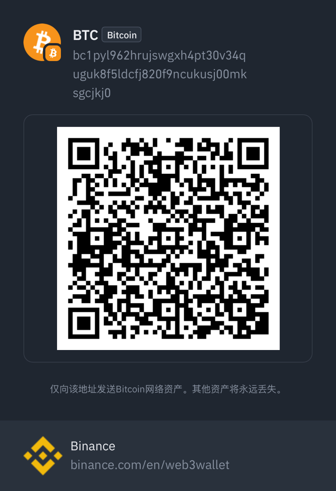

# Telegram Router

[English](docs/en/README.md) | [简体中文](docs/zh/README.md)

A Gin-style router for Telegram Bot API, providing middleware support and flexible message handling.

## Features

- 🚀 Gin-style routing system
- 🔌 Middleware support with chain calls
- 📝 Multiple message type handlers
- 🔄 Context-based request handling
- ⛓️ Middleware chain execution
- 🛡️ Request abortion support
- 🎯 Path parameter support
- 🔍 Query parameter support
- 📊 Poll and quiz handling
- 📍 Location-based routing
- 📁 File type filtering

## Dependencies

This project is built on top of the following open-source libraries:

- [go-telegram-bot-api](https://github.com/go-telegram-bot-api/telegram-bot-api) - Telegram Bot API wrapper for Go
  - License: MIT License
  - Version: v5.x

## Quick Links

- [Installation](docs/en/installation.md)
- [Basic Usage](docs/en/basic-usage.md)
- [Middleware](docs/en/middleware.md)
- [Message Types](docs/en/message-types.md)
- [Callback Routing](docs/en/callback-routing.md)
- [Advanced Features](docs/en/advanced-features.md)
- [Examples](docs/en/examples.md)

## License

This project is licensed under the MIT License - see the [LICENSE](LICENSE) file for details.

### Third-party Licenses

- [go-telegram-bot-api](https://github.com/go-telegram-bot-api/telegram-bot-api/blob/master/LICENSE) - MIT License
- [Gin](https://github.com/gin-gonic/gin/blob/master/LICENSE) - MIT License (for inspiration and design patterns) 

## Support the Project

If you find this project helpful, you can support it via the following ways:

**Bitcoin (BTC) Donation:**

*Only send Bitcoin to this address. Other assets may be lost forever.*

*欢迎通过比特币赞赏扶贫，感谢您的支持！*
*Support via Bitcoin donation (your contribution also helps support charitable causes).*

**微信支付 / WeChat Pay:**

*欢迎通过微信扫码赞赏扶贫，感谢您的支持！*
*Support via WeChat Pay QR code (for mainland China users; your donation also helps support charitable causes).*